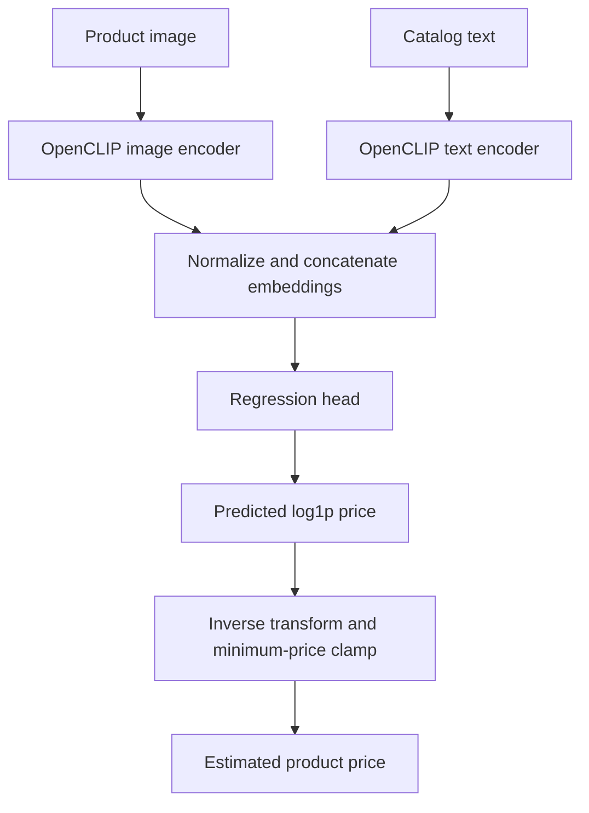

# Vision–Language Learning for Product Price Prediction

### Multimodal price estimation from product descriptions and images

This project estimates product prices by combining catalog text with product images. It adapts a pretrained **OpenCLIP ViT-L/14** model to price regression, using both modalities to learn pricing signals from product descriptions, specifications, quantity information, and visual appearance.

The project addresses a practical e-commerce problem: generating a reference price for a product when its catalog information is available. Such estimates can support listing workflows and help identify products that warrant a pricing review. The model learns observed prices; revenue optimization would additionally require demand, cost, and sales data.

**Achievement:** Our team, **MLRAs**, achieved **Rank 30 in the Amazon ML Challenge 2025** with this project.

**Repository status:** Training and inference code, along with compressed training and testing datasets, are included. Fine-tuned model weights are not included. Train the model to generate a checkpoint before running inference, or supply a compatible checkpoint separately.

## Key features

- **Multimodal learning:** combines text and image embeddings in a single price prediction model.
- **Selective fine-tuning:** adapts the later transformer blocks in both encoders to the pricing task.
- **Log-price regression:** trains with `log1p(price)` targets and Smooth L1 loss to reduce sensitivity to large price differences.
- **Batch inference:** exports product IDs and positive price predictions to CSV.
- **Reusable checkpoint:** saves the fine-tuned backbone, regression head, and backbone configuration for inference.

## How it works



### 1. Prepare product inputs

Each training example contains catalog text, a product image, and a known price.

- **Text:** `catalog_content` contains the title, description, and Item Pack Quantity (IPQ). Missing text is replaced with an empty string before OpenCLIP tokenization.
- **Images:** images are loaded locally using `sample_id` as the filename, checking `.jpg` before `.png`. Images are converted to RGB and passed through the model's evaluation preprocessing transform, which is also used during training in this implementation.
- **Missing images:** a black 224 × 224 image is substituted when neither expected file exists.
- **Targets:** rows with non-positive prices are removed before the training/validation split.

Brand, specifications, and quantity are represented through the catalog text. The current implementation does not extract them into separate structured features.

### 2. Learn complementary image and text representations

The backbone is OpenCLIP **`ViT-L-14`**, initialized with **`datacomp_xl_s13b_b90k`** pretrained weights. The image encoder represents visual information such as product appearance and packaging, while the text encoder represents the catalog description.

The first half of the transformer residual blocks in each encoder is frozen, and the final half is fine-tuned. Other backbone parameters retain their default trainable status. This preserves many pretrained features while allowing the model to adapt to the product pricing dataset.

This is a **single multimodal regression model**: the two encoders contribute features to one shared prediction head.

### 3. Fuse features and predict log-price

Image and text embeddings are independently L2-normalized, then concatenated. The fused representation is passed through this regression head:

| Layer | Configuration |
| --- | --- |
| Linear | Combined embedding dimension → 512 |
| Activation | ReLU |
| Regularization | Dropout, probability 0.1 |
| Linear | 512 → 1 |
| Output activation | Softplus |

The output estimates the transformed target:

$$
z = \log(1 + p)
$$

where $p$ is the product price. The log transformation compresses the price range, reducing the dominance of expensive products in the training objective.

### 4. Fine-tune with a robust regression objective

Training minimizes **Smooth L1 loss** with `beta=0.25` between the predicted transformed value and `log1p(price)`. For large residuals, this loss grows linearly, reducing the influence of extreme errors compared with a squared-error objective.

The training loop uses AdamW with separate learning rates for the backbone and newly initialized regression head, CUDA automatic mixed precision, gradient scaling, and a learning-rate schedule with warmup followed by cosine annealing.

### 5. Convert predictions into prices

During inference, the best saved checkpoint is loaded and predictions are converted back to the original price scale:

$$
\hat{p} = \max\left(\exp(\hat{z}) - 1,\ 1.0\right)
$$

The explicit minimum of **1.0** matches the inference script. It ensures positive outputs but also prevents predictions below 1.0, even if the dataset contains lower-priced products.

## Dataset

The original problem provides **75,000 labeled training products** and **75,000 unlabeled test products**.

The repository includes the dataset archives as **`training_data.zip`** and **`testing_data.zip`**. Extract them and arrange their contents as described in [Getting started](#getting-started). The scripts read CSV files and local image folders, so the ZIP files must be extracted before use.

| Column | Description | Availability |
| --- | --- | --- |
| `sample_id` | Unique product record identifier | Train and test |
| `catalog_content` | Product title, description, and Item Pack Quantity | Train and test |
| `image_link` | URL of the corresponding product image | Train and test |
| `price` | Observed product price and regression target | Train only |

The scripts consume downloaded images from disk. They do not download images directly from `image_link` or retrieve external product prices. The pretrained OpenCLIP weights provide general image/text representations; supervised price targets come from the supplied training data.

## Training configuration

| Setting | Value |
| --- | --- |
| Backbone | OpenCLIP `ViT-L-14` |
| Pretrained checkpoint | `datacomp_xl_s13b_b90k` |
| Epochs | 12 |
| Batch size | 32 |
| Optimizer | AdamW |
| Backbone learning rate | `1e-5` |
| Regression head learning rate | `1e-3` |
| Learning-rate schedule | One-epoch linear warmup, then cosine annealing |
| Training loss | Smooth L1, `beta=0.25`, on `log1p(price)` |
| Validation metric | RMSE on the original price scale |
| Checkpoint selection | Lowest validation RMSE |
| Train/validation split | First 90% / last 10% of rows after price filtering |
| Training batches | Shuffled |
| Random seed | 42 for Python, NumPy, and PyTorch |
| DataLoader workers | 4 |

The validation split follows CSV row order; it is not randomized before splitting. The original training run used an **NVIDIA RTX A6000 with 48 GB VRAM**, according to the team's project notes. This is the recorded training hardware, not a measured minimum requirement.

## Results and evaluation

| Result | Value | Basis |
| --- | --- | --- |
| Competition placement | **Rank 30** | Team-reported Amazon ML Challenge 2025 result |
| Validation RMSE | **23.74** | Team-reported result from the original training run |

The external evaluation metric is **Symmetric Mean Absolute Percentage Error (SMAPE)**:

$$
\operatorname{SMAPE}(\%) = \frac{100}{n}\sum_{i=1}^{n}
\frac{|\hat{p}_i-p_i|}{(|p_i|+|\hat{p}_i|)/2}
$$

Lower is better, with values ranging from 0% to 200%. The training script selects checkpoints using **validation RMSE**, while the benchmark evaluates predictions using **SMAPE**. A final SMAPE score is not provided in this repository.

These results describe the original project run. Its fine-tuned checkpoint, training logs, prediction CSV, and separate methodology document are not included in this repository. Training with the included code and prepared data generates a new checkpoint; results can vary with the environment and data preparation.

## Project files

| File | Purpose |
| --- | --- |
| `README.md` | Project overview, methodology, and usage instructions |
| `model3mark2.py` | Dataset loading, model construction, fine-tuning, validation, and checkpoint saving |
| `training_data.zip` | Compressed training dataset; extract before training |
| `testing_data.zip` | Compressed testing dataset; extract before inference |
| `vlm_inference_v4.py` | Checkpoint loading, batch inference, and CSV export |

The table lists the five files currently included in the repository. **`best_vlm_v4.pth` and `submission_v4.csv` are generated outputs**, not bundled files. An image-download utility and a dependency version lockfile are not included.

## Getting started

### 1. Clone the repository

```bash
git clone https://github.com/Azhar1303/Multimodal-Product-Price-Prediction.git
cd Multimodal-Product-Price-Prediction
```

Alternatively, download and extract the repository ZIP from GitHub.

### 2. Install dependencies

Use a Python environment with **CUDA-enabled PyTorch and matching torchvision** for GPU execution. Install the remaining dependencies with:

```bash
python -m pip install open_clip_torch pandas numpy pillow tqdm
```

The principal dependencies are Python, PyTorch, torchvision, OpenCLIP, pandas, NumPy, Pillow, and tqdm. Exact package versions are not pinned in the repository; use the original training environment's versions if available. See the [OpenCLIP installation instructions](https://github.com/mlfoundations/open_clip#installation) for dependency setup.

### 3. Extract the datasets

Extract the included archives using an archive manager or Python:

```bash
python -m zipfile -e training_data.zip extracted_data/training
python -m zipfile -e testing_data.zip extracted_data/testing
```

Locate the training and test CSV files in the extracted folders, then place them at the paths below, using the filenames `train.csv` and `test.csv`. If the archives contain enclosing folders, move the CSV files out of those folders as needed. ZIP extraction alone does not configure the scripts' input paths.

### 4. Configure paths and prepare images

Ensure the base path in each script points to your local project directory. To use the directory containing the scripts as the root, set the existing base-path assignment as follows, if it has not already been updated.

In `model3mark2.py`:

```python
BASE_DIR = os.path.dirname(os.path.abspath(__file__))
```

In `vlm_inference_v4.py`:

```python
BASE = os.path.dirname(os.path.abspath(__file__))
```

Both files import `os`. With the original relative path definitions, the scripts expect the following layout:

| Path relative to the project root | Contents |
| --- | --- |
| `student_resource/dataset/train.csv` | Training CSV extracted from `training_data.zip` |
| `student_resource/dataset/test.csv` | Test CSV extracted from `testing_data.zip` |
| `student_resource/dataset/train_images/` | Training images named `<sample_id>.jpg` or `<sample_id>.png` |
| `student_resource/dataset/test_images/` | Test images with the same naming convention |
| `vlm_runs_v4/best_vlm_v4.pth` | Generated by training; required for inference |
| `vlm_runs_v4/submission_v4.csv` | Generated by inference |

If your local script paths have been customized, place the extracted files at those configured locations instead.

The model also needs local product images. If images are present in the extracted archives, arrange them in the corresponding image folders. Otherwise, download them from the CSV files' `image_link` values. Name each image using its record's `sample_id`, for example `12345.jpg`, rather than relying on the filename in the URL.

The training and inference scripts do not download images. If you have the original starter kit, its `src/utils.py` provides an image-download helper; that file is not part of this repository. The missing-image fallback allows records to be processed, but reproducing the multimodal setup requires preparing the product images.

### 5. Train the model

**Complete training before inference unless you already have a compatible fine-tuned checkpoint.** The repository does not provide the original trained weights.

```bash
python model3mark2.py
```

Training initializes the OpenCLIP backbone from its general pretrained weights, which must be cached locally or downloadable. It then fine-tunes the model on the prepared product dataset, evaluates it after every epoch, and saves `vlm_runs_v4/best_vlm_v4.pth` whenever validation RMSE improves. The output directory is created by the training script.

### 6. Run inference

After training has created `vlm_runs_v4/best_vlm_v4.pth`, prepare the test CSV and images, then run:

```bash
python vlm_inference_v4.py
```

Inference processes records without shuffling and writes `vlm_runs_v4/submission_v4.csv` with exactly these columns:

```csv
sample_id,price
```

Each output row contains the corresponding input sample ID and a floating-point price prediction. If a downstream workflow requires the name `test_out.csv`, rename the generated output or change the output filename in the inference script.

Running the inference script without the checkpoint at its configured path will fail when the script attempts to load it.

## Model weights and generated artifacts

**The fine-tuned pricing checkpoint is not published in this repository, and no separate download link is currently provided.** You can generate your own checkpoint by running the training script. If you already have a compatible saved checkpoint, place it at the path configured by `CKPT` in `vlm_inference_v4.py`.

The training script saves a checkpoint named **`best_vlm_v4.pth`** containing:

| Key | Contents |
| --- | --- |
| `vlm_state` | Fine-tuned image and text encoder state dictionary |
| `head_state` | Trained price regression head state dictionary |
| `cfg` | Backbone model name and pretrained checkpoint identifier |

All three entries are needed by the inference script. The fine-tuned image/text encoders and regression head must be loaded together. The checkpoint does not include optimizer or scheduler state for exact training resumption.

The upstream `datacomp_xl_s13b_b90k` weights initialize the general-purpose OpenCLIP backbone. They do not contain the trained price regression head or the encoder updates learned during this project's fine-tuning, so downloading them alone does not enable price inference.

| Generated artifact | Created by | Purpose |
| --- | --- | --- |
| `vlm_runs_v4/best_vlm_v4.pth` | `model3mark2.py` | Best checkpoint selected by validation RMSE |
| `vlm_runs_v4/submission_v4.csv` | `vlm_inference_v4.py` | Test sample IDs and predicted prices |

## Implementation notes and future work

- **Long descriptions:** the helper is named `encode_long_text`, but the default CLIP tokenizer truncates to its context length before the helper checks token count. With the configured 77-token context, the current code does not implement effective sliding-window coverage of the full description. True chunking would need to happen before truncation. See the [OpenCLIP tokenizer implementation](https://github.com/mlfoundations/open_clip/blob/main/src/open_clip/tokenizer.py).
- **Device support:** the scripts use CUDA-specific mixed-precision calls, and one validation text-encoding call defaults to CUDA. Use a CUDA environment for the current implementation; CPU execution needs device-handling changes.
- **Image robustness:** nonexistent image files have a fallback, but corrupt or unreadable files are not explicitly handled.
- **Evaluation improvements:** add SMAPE tracking and checkpoint selection aligned with the benchmark, use a randomized or grouped validation split where appropriate, and retain training logs and controlled text-only/image-only comparisons.
- **Reproducibility:** pin dependency versions and expose paths and training settings through a configuration file or command-line arguments. Model initialization currently requests the pretrained checkpoint before loading the fine-tuned state, so the pretrained weights must be cached or downloadable.

## Team

**MLRAs:** Ankit Agrawal, Pratyush Jain, and Mohammad Azhar Khan.

Built with [OpenCLIP](https://github.com/mlfoundations/open_clip) and its [DataComp ViT-L/14 pretrained checkpoint](https://huggingface.co/laion/CLIP-ViT-L-14-DataComp.XL-s13B-b90K).
